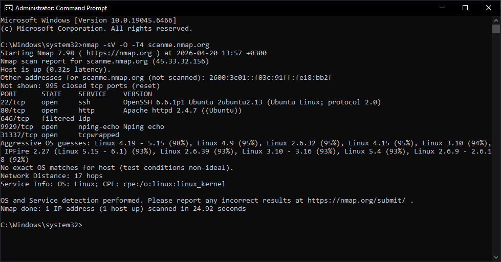
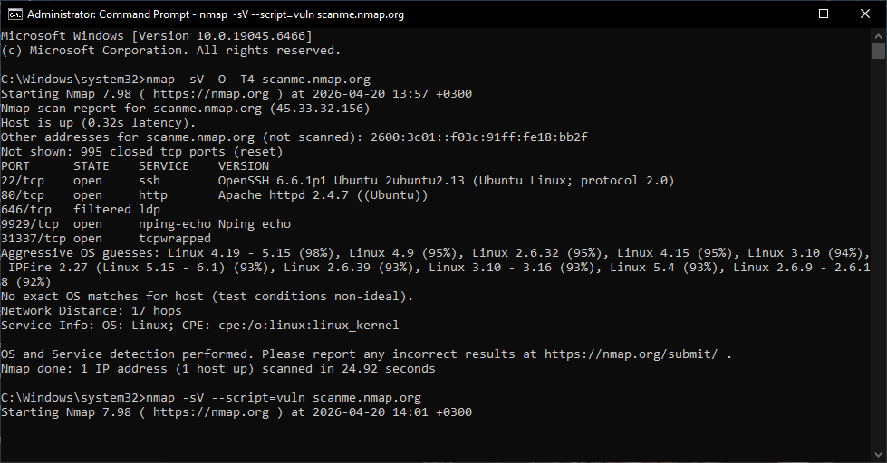

# 🛡️ Task 1: Vulnerability Assessment Report

**Prepared by:** [HOGLAH MAWONDO]  
**Internship Track:** Cyber Security (Future Interns)  
**Task ID:** FUTURE_CS_01  

---

## 1. Project Overview
*   **Target:** `scanme.nmap.org`
*   **IP Address:** `45.33.32.156`
*   **Objective:** Identify open ports, service versions, and associated security vulnerabilities.

---

## 2. 🛠️ Tools & Methodology
I used the following toolset to conduct a "Black Box" assessment:
*   **Nmap (Network Mapper):** Executed `nmap -sV -O -T4` for service versioning and OS detection.
*   **NSE (Nmap Scripting Engine):** Ran `--script=vuln` to automate CVE detection.
*   **Browser DevTools:** Analyzed HTTP response headers to identify missing security flags.

---

## 3. 📊 Vulnerability Risk Matrix

| Vulnerability Name | Port / Service | Severity | Status |
| :--- | :--- | :--- | :--- |
| **Outdated OpenSSH (regreSSHion)** | 22 / SSH | 🔴 **CRITICAL** | Open |
| **Legacy Apache HTTP Server** | 80 / HTTP | 🟠 **HIGH** | Open |
| **Unencrypted HTTP Traffic** | 80 / HTTP | 🟡 **MEDIUM** | Open |
| **Information Leakage (Nping)** | 9929 / TCP | 🔵 **LOW** | Open |

---

## 4. 📸 Technical Evidence

---

## 5. 🔍 Technical Findings
### Finding 1: Critical SSH Vulnerability
*   **Service:** OpenSSH 6.6.1p1
*   **Risk:** Vulnerable to **CVE-2024-6387 (regreSSHion)**.
*   **Impact:** Allows unauthenticated remote code execution (RCE) with root privileges.

### Finding 2: Outdated Web Server
*   **Service:** Apache httpd 2.4.7
*   **Risk:** Susceptible to multiple CVEs including Request Smuggling and DoS.
*   **Impact:** Compromise of web integrity and potential for Man-in-the-Middle (MITM) attacks.

---

## 6. ✅ Remediation Plan
1.  **Immediate:** Update OpenSSH to version 9.8p1 or newer.
2.  **High Priority:** Upgrade Apache to 2.4.60 and install an SSL certificate.
3.  **Ongoing:** Close Port 9929 if not strictly required for troubleshooting.
